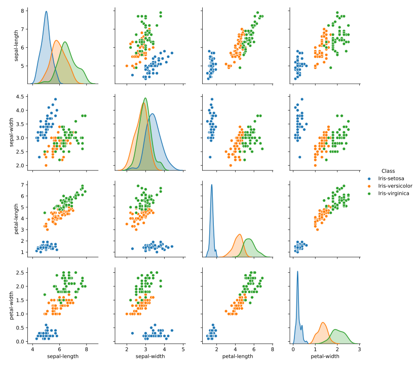
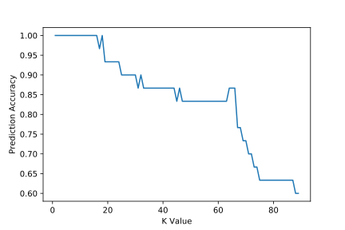
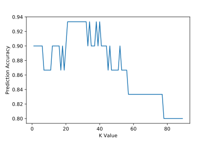

## 1. 目标

* 问题描述
* 数据分析
* 中间结果分析
* 结果讨论
* 缺点认识

<!-- more -->

## 2. 问题描述及数据定义

### 2.1 问题描述

利用KNN算法对iris数据集进行分类，并用训练集的训练结果对测试集进行预测，观察预测效果。

因为数据集是有标签的，所以这是一个典型的有监督分类问题

### 2.2 数据定义

数据来源：[UCI](http://archive.ics.uci.edu/ml/datasets/Iris)

iris数据集中共有3个种类的花，每种花各有50个*样本*：

* 其中一个样本与另外两个样本线性可分
* 其中另一个样本与另外两个样本线性不可分

每个*样本*各有4个*属性（x）*：

1. sepal length in cm 
2. sepal width in cm 
3. petal length in cm 
4. petal width in cm

预测结果一共有3种：

* setosa
* versicolor
* virginica

### 2.3 计划流程

1. 读取、处理数据
2. 实现KNN
   1. 计算相似性（使用欧几里得距离）
   2. 计算最相近的K个邻居
3. 生成预测
4. 观察结果（预测准确性）

## 3 代码实现

具体代码见`notebooks/knn-iris.ipynb` 或者`notebooks/knn-iris.html` 

### 3.1 读取、处理数据

首先通过读取iris.data可以得到这样的信息

通过统计可以发现petal-length的标准差最大，猜测可能含有最多信息

为了验证算法的效果，我们将数据分成训练集和测试集，比例为4:1

之后为了排除数据大小的干扰，再将数据标准化

通过可视化可以看出在二维平面上也能大概分出3种花

### 3.2 实现KNN

KNN算法有不同的形式

* 无监督学习：
  * 聚类
* 有监督学习：
  * 标签离散：分类
  * 标签连续：回归

我们在这里要实现的有监督学习下的标签离散情况，也就是分类。

K近邻分类器是一个基于样本的分类器，也就是说它并不会训练一个General的模型来预测分类，而是简单地根据样本距离来进行投票确定分类

创建一个类KNN_Classification
有以下函数

* 计算欧式距离 

  $d\left(x, x^{\prime}\right)=\sqrt{\left(x_{1}-x_{1}^{\prime}\right)^{2}+\left(x_{2}-x_{2}^{\prime}\right)^{2}+\ldots+\left(x_{n}-x_{n}^{\prime}\right)^{2}}$ 

  * 要注意向量长度，不要将标签值也计算进距离中
  * 可以调用numpy来提高运算速度
* 计算获取最近邻
* 输出预测结果

### 3.3 预测结果 

因为在KNN算法中只有一个K值是可以改变的变量，因此我改变K值来观察预测效果，但是发现预测结果会不断变化。

测试条件：K取1-90

大部分情况下预测精度随K值的变化规律是这样的

也就是说随着K值的增大，预测精度是不断降低的。

但是在测试过程中也出现过以下情况的变化规律

这种情况比较反常，也即是K稍大时预测结果较好，K偏小或偏大时效果都不佳。

## 4 分析

### 4.1 异常测试结果分析

在3.3 中出现的问题，经过分析我认为是以下原因造成的

* 样本较少。因为一共只有150个样本，还有分成训练集和测试集，所以效果不好。
* 随即采样。对于有着很多样本的数据来说，这样采样方式可能没有什么问题，但是因为这个数据集样本太少，导致采样结果不再能反应数据的真是分布。
* KNN算法的原理。自己实现过KNN之后我发现，其实对于KNN算法来说，分成测试集和训练集的意义和一般的机器学习算法不同：KNN的模型就是数据本身（训练集），所以数据的多少和分布是否有效（能代表真实分布）会很大程度上影响预测效果。所以因为前两点原因加上KNN自身的算法，导致了预测结果的不稳定

### 4.2 K值选取

在KNN算法中，K是唯一一个超参数(hyper parameter)，因此要想达到好的预测效果，选择一个合适的K是非常重要的。

从图像上看，K控制的是分割平面的边界。比如说当K较小时，这个区间就会较小，直观上理解就是K仅仅观察临近的几个样本，而没有全局意识，哪怕它的旁边有一个异常点，它也把异常当成同类

另一方面，当K较大时，预测值更加关注的是全局的情况，所以这时它就会忽略一些异常值，这使得边界更加平滑

### 4.3 KNN算法的优缺点

优点：

* 容易理解，容易实现(核心代码不足百行)
* 计算速度快，最耗时的操作也不过是计算距离
* 适用于多分类问题

缺点：

* 对数据集要求较高，在合适的数据集（样本量大，分布均匀，样本平衡）上能狗取得不错的效果，但是一旦数据集不佳，效果会大打折扣
* 在维数较高的场合效果不佳，因为计算的是欧氏距离，所以距离是平方和，因此无法体现出各个维度的区别

### 4.4 改进方法

* 使用不同的相似性度量，而不是简单的欧氏距离
* 在高维数据上使用时可以采用**数据降维**，使用PCA等算法降低维数，改善效果
* 使用K-D tree等方法存储数据，减小计算量

## 5 总结

在这个项目中，我学习了KNN算法，包括它的工作原理和如何编写KNN算法、如何使用KNN算法。我使用KNN算法对iris数据集进行测试，得到的效果还不错。

## 参考资料

[Pairplot](https://seaborn.pydata.org/generated/seaborn.pairplot.html)

[A Complete Guide to K-Nearest-Neighbors with Applications in Python and R](https://kevinzakka.github.io/2016/07/13/k-nearest-neighbor/)

[Tutorial To Implement k-Nearest Neighbors in Python From Scratch](https://machinelearningmastery.com/tutorial-to-implement-k-nearest-neighbors-in-python-from-scratch/)