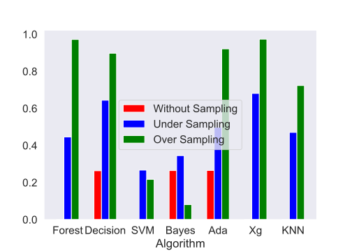

## 1. 目标

* 选择一个侧重工业领域的数据集
* 分析数据
* 分析问题，分析结果

<!-- more -->

## 2. 问题分析

### 2.1 问题

> A complex modern semi-conductor manufacturing process is normally under consistent surveillance via the monitoring of signals/variables collected from sensors and or process measurement points. However, not all of these signals are equally valuable in a specific monitoring system. The measured signals contain a combination of useful information, irrelevant information as well as noise. It is often the case that useful information is buried in the latter two. Engineers typically have a much larger number of signals than are actually required. If we consider each type of signal as a feature, then feature selection may be applied to identify the most relevant signals. The Process Engineers may then use these signals to determine key factors contributing to yield excursions downstream in the process. This will enable an increase in process throughput, decreased time to learning and reduce the per unit production costs. 

简单来说，在半导体加工行业中，我们希望通过流水线上各个传感器的信号来预先判断最后产品合格与否。

在过去，一般会采用多元统计的分析方法来进行预测，但是现在的生产实际过程中有相当多的传感器收集了过多的信息，因此并不能使用原来的方法。另外，这些信息的重要程度不同，有一些还参杂了许多噪声，因此我们要进行特征提取，选择合适的模型进行分析

数据来源： [SECOM Data Set](http://archive.ics.uci.edu/ml/datasets/secom)

### 2.2 数据格式定义

数据来自半导体加工工厂，数据来自半导体生产线上的传感器，整体数据已经经过了脱敏的处理，因此无法得知每个属性数据来自哪种，哪一个传感器。数据按时间点记录，1567条数据代表着1567个时间点上生产线上传感器所记录的数据。

* [secom.data](http://archive.ics.uci.edu/ml/machine-learning-databases/secom/secom.data)
  * $1567\times961$ 说明有1567个数据样本，961个特征，都是数值
* [secom_labels.data](http://archive.ics.uci.edu/ml/machine-learning-databases/secom/secom_labels.data)
  * $1567\times2$ 有1567个数据标签，其中一个是结果，另一个是获取数据的时间
  * $-1 $代表通过（PASS），$1 $代表失败（FAIL）
  * 缺失的数据由`NaN`表示

> 实际中的NaN是由什么产生的呢
>
> As with any real life data situations this data contains null values varying in intensity depending on the individuals features. This needs to be taken into consideration when investigating the data either through pre-processing or within the technique applied. 

### 2.3 从数据到问题

在过去，一般会采用多元统计的分析方法来进行预测，但是现在的生产实际过程中有相当多的传感器收集了过多的信息，因此并不能使用原来的方法。另外，这些信息的重要程度不同，有一些还参杂了许多噪声，因此我们要进行特征提取，选择合适的模型进行分析。同时由于数据提供的结果数据是用1和-1代表的质量数据，所以我们要解决的生产质量预测问题可以转化为一个二分类的问题。即利用生产线上的传感器数据来将产品进行质量合格和质量不合格的二分类。

### 2.3 计划流程

1. 加载数据
2. 空缺数据填补
3. 特征选择
4. 尝试不同分类模型
5. 验证模型效果

## 3. 数据预处理

### 3.1 可视化分析

### 3.2 数据清洗

首先，961个特征中不能每个特征都对最后的结果都有可观的影响。因此遵从一般的原则，我们可以将其中一些特征删除。这些特征应该满足以下条件：

* 是一个常数
* 不是常数，但是方差很小，可以认为是一个常数

我们首先观察*Secom_labels.data*中的数据，将两个数据表中质量标签缺失的数据从我们的整体数据中清洗掉。

但是在这一步中我们并没有进行离群点的筛查。一是质量表征的数据过于复杂，二是作为工业生产线上的数据，突变的离群点很大可能是质量不合格的原因。因此在这里我们并没有进行离群点的筛查。

### 3.3 数据填补

我们研究数据可以发现，许多特征并不是完整的，也就是说他们没有1567个样本，缺少的数据以`NaN`体现。

我们选择的方法可以是：

* 平均值填补
* IN-painting KNN (from paper BDCC)  

注意到我们的数据几乎都离0值较远，因此我们选用0来对我们的数据进行填补。

### 3.4 特征选择

在填补了缺失的数据之后，我们还要进行特征选择，来精简掉一些不重要的信息，提高我们算法的运算速度

其中包含的方法有数据降维PCA、通过模型计算各个参数的重要性并排序

### 3.5 数据平衡化

在观察数据的过程中，我们发现SECOM这个数据集是imbalance的：也就是说数据集中的正样本数和负样本数是不匹配的。通过的(-1)的样本数要远远多于不通过的样本数(1)。*这在实际生产中是非常常见的，因为一个工厂的良品率肯定是要比较高的，不然生产的产品一大半不合格的话，成本太高了。*

然而不均衡的样本会导致不均衡的数据分布，这样就会使得各个分类算法的效果大大降低。(from learning from imbalanced data)

那么要使数据平衡有两种方法，一种是对少的那部分样本进行过采样使得样本数量和多的样本接近，或者对多的那种样本进行欠采样。

我们选择的是过采样方法，SMOTE （Synthetic Minority Oversampling Technique），这种方法会根据插值来产生新的数据

## 4. 使用不同模型进行预测

### 4.1 可用的算法

回顾我们的问题，我们要根据所拥有的传感器信息判断这个产品是好还是坏，搜易最后的结果只有两种可能， 这是一个典型的二分类问题。又因为这是一个有标签的有监督学习，所以我们可以将整个问题归纳为**有监督的二分类学习**

二分类学习算法有很多，常见的有以下几种

* 朴素贝叶斯

  * 优点：需要估计的参数少
  * 缺点：需要知道先验概率，假设属性之间相互独立
* 决策树

  * 优点：易于理解，适合高维数据

  * 缺点：容易过拟合，忽略了属性之间的相关性
* 逻辑回归

  * 优点：速度快
  * 缺点：需要较多的特征工程
* KNN
  * 优点：不需要训练，数据即模型
  * 缺点：在高维数据下表现不好
* 集成学习方法
  * Adaboost
  * XGBoost
  * 随机森林

### 4.2 需要注意的问题

因为我们的数据是典型的不平衡数据，也就是说正样本的数量要远远多于负样本，这就导致我们不能用一般的分析方法来观察结果的好坏，比如说*准确率*，判断正确的占所有判断的比值，这样会造成的问题就是即使我们的算法把所有的样本都判断为正，最后得到的*准确率*依然很高，因为正样本太多了，所以我们在分析时要使用其他不同的评判标准。

### 4.3 预测结果

为了让实验结果更加完整，我们对比了不同方法下的预测效果：

* 数据处理上
  * 原数据
  * 欠采样
  * 过采样
* 模型方法
  * 随机森林
  * 决策树
  * SVM
  * 朴素贝叶斯
  * AdaBoost
  * XGBoost
  * KNN

#### 4.3.1 原数据

从准确度角度看，不进行采样直接使用各种算法的预测结果如下

看上去效果还可以，但是仔细思考的话，就会发现这样的准确率是没有什么意义的，因为正样本太多，所以哪怕算法将所有的样本都判断为正样本，最后也能得到非常高的预测准确度。

这一点我们可以从观察算法的混淆矩阵看出来，下面展示的两张混淆矩阵代表了大部分算法的混淆矩阵情况

可以看到正如我们之前所猜测的那样，模型的预测效果很差，将大部分样本呢都标定为正样本

#### 4.3.2 欠采样

既然样本不平衡时会出现这样严重的问题，我们就需要对样本进行平滑化处理，首先我们测试的方法是使用欠采样。

欠采样的方法比较简单直观，我们只需要将数据量多的样本（在这里是正样本）随机的删除掉一些，最后让正负样本量相同即可

这样的情况下，再使用7种算法进行预测得到的结果如下

可以看到，在欠采样的情况下，各个算法的预测准确度大大降低，几乎都只有一半左右，考虑到这是一个二分类问题，接近50%的预测准确度就相当于乱猜了。

混淆矩阵如下

从混淆矩阵可以看出，各个情况下的数据都差不多，也证实了我们的猜想，算法在欠采样的情况下没有了基本的判断能力，判断结果和随机类似。

为什么会出现这样的情况呢？其实从欠采样的工作原理就能大概猜到了，那就是数据量太小，由于本身负样本的数量就很少，只有一百多，现在将正样本的数量缩减到和负样本相同的情况下，总共的样本数也就只有两百多，在这么少的训练样本情况下，训练效果不佳也是可以预见的。

#### 4.3.3 过采样

既然不采样和欠采样都没有很好的效果，我们只能使用另外的方法来解决数据不平衡问题，那就是——过采样

我们采样的方法是SMOTE （Synthetic Minority Oversampling Technique），这种方法会根据插值来产生新的数据。

预测效果如下：

可以看到，在过采样的情况下，一部分算法的效果大大提升，而另一些算法仍然保持着较低的预测结果

从混淆矩阵来看，取得较好预测结果的算法混淆矩阵大概如下

可以看到效果还是非常不错的，能够将大部分的正负样本预测出来。

### 4.4 结果分析

我们最终的目的是要寻找一个优秀的算法能够较好地预测结果，所以我们需要算法

* 能够在所有的故障中尽量将故障选择出来，这是最重要的部分，因为将一部分正常产品检测为故障问题不是特别大，无非是提高一点成本。但是一旦故障检测率太低，就会造成产品有重大缺陷，对于下游厂商来说是不可接受的。
* 能够将所有的正常产品尽量多地通过，虽然在上一点说过故障检测率是最重要，但是正常产品的检测效果一样重要，因为如果这样检测率太低就有可能导致将许多正常产品都标定为故障，这样的话会大幅提高生产成本和二次检查的成本，对于厂商来说也是不可接受的。

首先观察一下各个算法在不同的采样情况下能否正确地将故障从故障中找到

可以看到，这时过采样的效果很好

再来观察一下各个算法在不同的采样情况下能否正确地将正常样本识别出来

可以看到，在这种情况下过采样和不采样的效果是较好的。

那么如何将两种判断标准结合起来呢？我们最终使用的判断标准是将上述两个标准的数值取调和平均，得到的结果如下：

可以看到，在过采样情况下，随机森林和XGBoost这两种算法的效果是最好的，其他的几种情况和算法都不尽如人意。

我们分析这两种取得优秀效果的原因有以下几点：

1. 我们的数据是流水线上的传感器信息，而且数量较多，有上千个，因此这样的数据之间一定是有很强的相关性的。比如说一个工艺之后到另一个工艺之间产品的性质并不会发生天翻地覆的变化，一定是慢慢变化的。
2. 表现优秀的几种算法都是基于决策树的，而决策树的优势就在于能够在数据有很强相关性的情况下进行分类，因此这样的算法和我们的数据集比较吻合，达到了较好的效果
3. 其他的一些算法比如朴素贝叶斯则假设的是各个特征之间相互独立，明显和我们的数据不吻合，因此效果很差。

## 5.总结与展望

我们利用了一般的数据分析流程对半导体加工数据进行了数据填补、数据清理、特征工程、样本平衡化和建模预测，最终结果表明在过采样情况下，随机森林和XGBoost这两种算法的效果是最好的。

后续工作：

* 更加细致的特征工程
  * 数据进行补全的不同方式效果对比
  * PCA保留的主成分多寡效果对比
  * 对于异常值的删选

* 模型的调参

  * Grid Search 穷举搜索

    目前我们所使用的模型都使用默认的参数，所以最终效果大概率不是最好的，如果使用Grid Search对参数进行遍历搜索，会取得更加优秀的预测效果

* 尝试不同的学习方法

  * 迁移学习

    因为这个数据的样本量较少，因此训练效果不佳，但是迁移学习可以将在其他大数据上所学习到的模型套用在本模型上，获得更好的效果

  * 故障诊断

    现在我们的思路是把问题作为一个二分类问题，但其实也可以作为一个故障诊断问题，也就是从数据出发，不直接对特征建模，而是观察数据的异常。这样的思路也是非常合理的，因为有故障的样本一般会在某些特征上与一般样本不同，所以可以通过检测某些特征的离群点来判断样本是否有故障