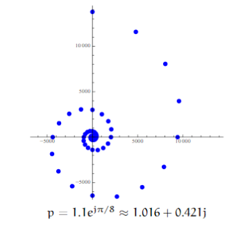
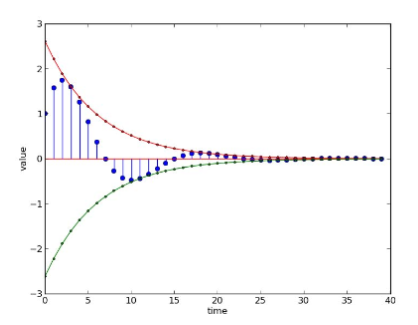

# 信号与系统

上一章主要的目的就是如何构建**复杂**系统, 主要是和编程有关, 已经是抽象过一次了, 不需要了解物理层面的问题. 这种状态机的方式有一个问题就是有时候系统太过于复杂, 以至于我们必须要实际运行系统然后再看看实际发生了什么

这一章, 主要介绍的是如何对物理系统建模和控制, 也就是比上一级更加low-level的内容, LTI, 通过一个模型, 将一些输出$x(t)$转化成输出$y(t)$, 因为系统是离散的, 所以我们可以用差分方程或者方块图来表示这个系统, 然后教授通过一个简单的例子说明了为什么差分方程可以变成简单的代数形式(因为比如一个右移**算符Operator**就可以表示差分), 这让学生在直观上了解了差分方程表示法的优点(容易转换成简单的计算相比于差分方程, 表达又很简介相比于方块图).

如果有反馈的话, 会出现算符作为分母的形式, 我们可以用无穷级数来表示, 比如
$$
\frac{1}{1+2R}=1-2R+4R^2-8R^3 \cdots
$$
这也解释了为什么有反馈的滤波器是无线脉冲响应的(IIR)

<!-- more -->

> 现在我能明白这是Top-Down的教学或者学习方式, 我最早接触这种学习方式是在学习计算机网络时使用的教科书: "计算机网络: 自顶向下的方法", 当时读的时候就觉得非常舒服, 很自然, 先知道目的, 然后逐渐了解一些底层的实现细节. 对我来说这是更加高效的方式(相比于Bottom-Up). 先学电子电路, 物理, 直到大二下才有机器人导论, 到玉泉再学机器人的设计与实践, 在这样的学习过程中我有很长一段时间不知道自己学的东西有什么用, 只是单纯的从理论到实践的过程.
>
> 老师的水平和授课质量就不说了, 差距太大, 对知识的理解完全不在一个层次上. 

## 1 基础知识

LTI, 前馈, 反馈之类的

### 助教课 LTI动机与表示

主要应用在控制系统中, 是为了通过建模预测系统之后的输出

## 2 预测系统行为

假设我们已经知道了系统的代数方程表示, 我们要如何预测系统的输出?

* 单位冲击响应s
* 通过系统的**极点(Poles)**来了解

先研究一阶的, 比较简单, $\frac{1}{1-p_0R}$, 如果$P_0<1$收敛, 否则就发散

### 二阶系统

再研究二阶的, 稍微复杂一点, 可以看成是**两个一阶的级联**或者**两个一阶的累加(拆分)**

为了方便因式分解, 令$R=\frac{1}{z}$, 这样可以方便找出方程的极点, 设未知数求解也可以

* 如果都是实根, 比较简单, 和1比大小就行

* 如果有复根, 将其表示为指数形式(为什么要这样呢?因为这样的表示在做幂的时候比较简洁), 那么复根会怎么影响输出呢? 主要看幅值最大

  > 类似于之前反馈时提到的无穷级数, 对于复数也可以这样操作
  > $$
  > \frac{1}{1-\operatorname{re}^{j \Omega} R }=1+ r e^{j \Omega} R +r^{2} e^{j 2 \Omega} R ^{2}+\cdots
  > $$
  > 
  > 
  >
  > 因为现实生活中的模型都是**实参数**的, 因此**复根都是共轭**的, 所以分母乘起来复数就消失了

二阶系统有两个复根时可以表示成这样
$$
\frac{Y}{X}=\frac{\frac{1}{2}(1-j \cot \Omega)}{1-r e^{j Q} R }+\frac{\frac{1}{2}(1+j \cot \Omega)}{1-r e^{-j \Omega} R }
$$

$$
y[n]=r^{n}(\cos n \Omega+\cot \Omega \sin n \Omega)
$$

利用
$$
-\sqrt{1+\cot ^{2} \Omega} \leqslant \cos n \Omega+\cot \Omega \sin n \Omega \leqslant \sqrt{1+\cot ^{2} \Omega}
$$
得到了
$$
-\frac{1}{\sin \Omega} r^{n} \leqslant y[n] \leqslant \frac{1}{\sin \Omega} r^{n}
$$
可以看出,$\Omega$和$r$影响了系统的响应

其中$r$代表了红色和绿色的线, 也就是收敛的速度,

而$\Omega$表示了振荡的速度 

### 特殊情况

* 零点极点消除, 一般来说不能消除(*不是很理解*)
* 重复极点
* 可叠加

## 3 设计实例 反馈控制

让一个小车检测到墙壁的距离并在停在一定距离, 使用**比例控制**

### 3.1 不考虑延迟

理论上传感器获取数据是有延迟的, 从传达指令到实际速度执行也是有延迟的. 这里暂时不考虑

1. 先列差分方程
   $$
   v[n]=k(d_i[n]-d_0[n])\\
   d_0[n]=d_0[n-1]-Tv[n-1]\\
   d_s[n]=d_0[n-1]
   $$
   注意到这个差分方程其实包含了许多个方程(近似3n)和很多个未知数, 不便于处理和计算, 转成算符方程, 方程式就少了很多

2. 转成代数形式
   $$
   V=k(D_i-D_0) \\
   D_0=RD_0-TRV\\
   D_0=\frac{-TKR}{1-(1+TK)R}D_i
   $$

3. 看根的情况

   一个根是$1+TK$, 为了让系统能够收敛, $|1+TK|<1$. 

   现在假设$T=0.1$, 显然$K=-10$是最好的, 一步收敛

#### 3.2 考虑延迟

1. 先列差分方程
   $$
   v[n]=k(d_i[n]-d_0[n-1])\\
   d_0[n]=d_0[n-1]-Tv[n-1]
   $$
   

2. 转成代数形式
   $$
   V=k(D_i-RD_0) \\
   D_0=RD_0-TRV\\
   D_0=\frac{-TKR}{1-R-TkR^2}D_i
   $$

3. 看根的情况

   两个个根是$\frac{1}{2} \pm \frac{1}{2} \sqrt{1+4 k T}$, 