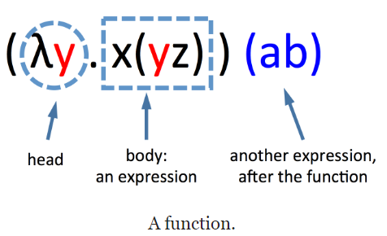
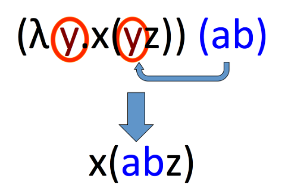

## 0 介绍

图灵机可以解决计算所有的问题. 有些问题无法通过计算解决.

对于人工智能来说, 可计算性是一个非常重要的议题, 值得学习与思考

$\lambda$运算 是与图灵机类似的一种工具, 听说比图灵机更加简洁. 因此学习并记录

## 1 历史

发明者: Alonzo Church. 美国逻辑学家

发明初衷: 给逻辑学提供一个基础, 代替罗素的类型理论和策梅洛的集合理论

作用: 系统中的$\lambda$演算具有良好的性质, 可以等价地定义出**可计算函数**. 用$\lambda$演算证明了判定性问题不可答, 比[图灵证明停机问题不可判](https://www.youtube.com/watch?v=7TycxwFmdB0&list=PL8dPuuaLjXtNlUrzyH5r6jN9ulIgZBpdo&index=16)更早

发展: 计算机出现后, 有研究者发现$\lambda$演算可以看成是一种程序设计语言(如Lisp). 因为它既可以描述计算过程, 也可以看成一个数学对象, 用于推导证明命题

## 2 解释

所有的操作就是

1. 读取一行符号或字符
2. 剪切和粘贴

这样的过程定义了所有的可计算过程, 也就是说只要是能计算表示的都可以用它来表示

Input: 一个**表达式**, 长得像$(\lambda x.xy)(ab)$

* 单个的字母,像$a\ b\ c$等, 被称为**变量**, 可以写在一起
  * 变量没有实际意义或者值, 就像是函数中的形参
* 括号$(\ )$, 用来表示其中的表达式是一起的
* $\lambda$, 用它和$.$ 我们用来表示一个**函数**, 表示函数的开始. 也成为**head**

### 剪切和粘贴

如果一个函数后面跟着一个表达式, 那么我们可以解析这些函数

解析的方式：获取头部中提到的变量, 将其在正文中出现的所有内容替换为函数后面的表达式

所以说函数就是告诉我们要在哪里替换变量

## 3 例子:数字

数字是我们最常计算的东西.

### 3.1 所有的自然数

我们首先来定义所有的自然数, 方法是: 定义0,然后定义递增的操作
$$
0: \Leftrightarrow \lambda \ sz .z
$$
类似的, 我们定义

* 这种定义看起来确实非常奇怪, 但是从数学角度上来说是和我们用$1,2,3...$或者**一二三四五**没什么区别的,都是用符号来表示一个数. 和人类的名字一样, 我们只是用其来表示这个人, 就算换一个名字, 这个人还是这个人

$$
\begin{aligned}
&\begin{array}{l}
1=\lambda \text { sz.s }( z ) \\
2=\lambda sz . s ( s ( z ))
\end{array}\\
&3=\lambda \operatorname{sz} \cdot s(s(s(z)))\\
&4=\lambda \operatorname{sz.s}( s ( s ( s ( z ))))
\end{aligned}
$$
我们也可以说, 我们在$z$上应用$s$这个操作n次

一个有趣的递增函数可以是

$$
S: \leftrightarrow \ \lambda \ abc.b(abc)
$$

$$
\begin{aligned}
S 0 &=(\lambda abc \cdot b ( abc ))(\lambda s z \cdot z ) \\
&=\lambda bc \cdot b ((\lambda s z \cdot z ) bc ) \\
&=\lambda bc \cdot b ((\lambda z \cdot z ) c ) \\
&=\lambda bc \cdot b ( c )
\end{aligned}
$$

根绝我们的定义, 这就是$1$

### 3.2 算数

加法可以非常自然地用到我们上面所用的定义, 比如说$1+2$, 就是在$1$上做两次递增操作, 可以表达成$1S2$
$$
1+2=3S5
$$
乘法我们需要新的定义, $\lambda \ abc.a(bc)$

* 通过验算可以证明其正确性

减法是和加法相对的, 虽然说我们知道了加法的定义, 与之相对的就是减法的定义. 但是这个只是说明性的描述. 我们实际需要的是如何定义这个减法计算

...后续还有很多操作可以定义, 比如说逻辑, 条件