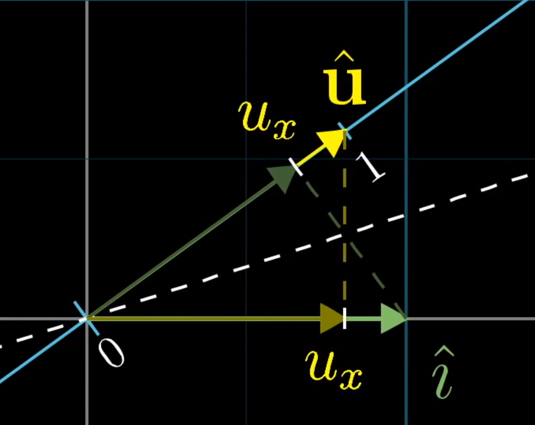

## 几何上理解**矩阵**：作为一个变换函数

* 列向量是对空间的**基底**的变换
  * 有$N$列代表着**输入**是$N$个基向量
  * 有$M$行代表着**输出**是用$M$个数代表的坐标

## 几何上理解零空间

零空间、核，都描述的是一个东西

经过变换之后都变成零向量$\hat{0}$上的空间

也可以说是，已知变换矩阵$A$
$$
A\hat{x}=\hat{0}
$$
的解

## 几何上理解非方阵：升维或降维

非方阵是**升维**或者**降维**

- 注意：升维后虽然在高维空间，但是**张成的空间**还是**原来的维数**

## 几何上理解点积

经典解释：配对相乘并相加

几何解释：投影长度

从几何角度也能方便理解为何点积与**顺序无关**

----

那么问题来了，怎么理解这两种不同的解释之间的关系呢？为什么相应的坐标相乘和投影是一样的呢？

问题的关键在于**对偶性**：我们需要将矩阵和向量联系在一起看
$$
1 \times 2 \text { matrices } \longleftrightarrow 2 \mathrm{d}\text{ vectors}
$$

$$
\left[\begin{array}{ll}{1} & {-2}\end{array}\right]\longleftrightarrow \left[\begin{array}{c}{1} \\ {-2}\end{array}\right]
$$

先介绍**矩阵向量乘积**：把向量**放倒**，$1\times2$的矩阵就是一个降维的投影，降维成一条直线，在这条直线上取一个单位向量$\hat{u}$

基底$\hat{i}$的变换等于到$\hat{u}$的投影，根据对称性，恰好等于$\hat{u}$到$\hat{i}$的投影，也就是$u_x$，同理对另一个基底也是一样的，因此，变换后的$\hat{i}，\hat{i}$的位置就是$\left[\begin{array}{ll}{u_{x}} & {u_{y}}\end{array}\right]$

所以矩阵向量乘积可以理解为投影
$$
\left[\begin{array}{ll}{u_{x}} & {u_{y}}\end{array}\right]\left[\begin{array}{l}{x} \\ {y}\end{array}\right]=u_{x} \cdot x+u_{y} \cdot y
$$
具体含义就是如图所示

那么**点积**，其实就是*矩阵向量乘积*的**另一种定义**，把矩阵竖起来
$$
\left[\begin{array}{c}{u_{x}} \\ {u_{y}}\end{array}\right] \cdot\left[\begin{array}{l}{x} \\ {y}\end{array}\right]=u_{x} \cdot x+u_{y} \cdot y
$$

## 几何上理解叉积

### 常规解释

$$
\overrightarrow{\mathbf{v}} \times \overrightarrow{\mathbf{w}}=平行四边形的面积
$$

这里的平行四边形指的是以$\overrightarrow{\mathbf{v}}$和$\overrightarrow{\mathbf{w}}$为边的平行四边形

* 如果v在w的右边，则面积是正的。反之面积为负
* $\overrightarrow{\mathbf{v}} \times \overrightarrow{\mathbf{w}}=-\overrightarrow{\mathbf{w}} \times \overrightarrow{\mathbf{v}}$ 

---

三维的叉积如何计算？
$$
\left[\begin{array}{l}{v_{1}} \\ {v_{2}} \\ {v_{3}}\end{array}\right] \times\left[\begin{array}{l}{w_{1}} \\ {w_{2}} \\ {w_{3}}\end{array}\right]=\operatorname{det}\left(\left[\begin{array}{ccc}{\widehat{\imath}} & {v_{1}} & {w_{1}} \\ {\hat{\jmath}} & {v_{2}} & {w_{2}} \\ {\hat{k}} & {v_{3}} & {w_{3}}\end{array}\right]\right)
$$

* 注意: 这里将向量写作矩阵的列，而教科书中大多数将向量写成矩阵的行。这两种做法没有差异，因为转置不改变行列式的值。这里只是为了更加直观
* 第一列的元素比较奇怪，在下一小节中解释

### 从线性变换解释

类比二位的点积情况

把第一列的元素理解成**变量**，后面两列理解成**底面积**，这样就可以把叉积理解成一个**体积**(行列式的几何意义)

1.  还是利用对偶性，定义一个从三维到一维的线性变换

   存在一个$1\times3$的矩阵来表示这个变换

2. 找到**对偶向量**$p$

   使得这个向量和一个向量点乘时，可以满足
   $$
   \left[\begin{array}{l}{p_{1}} \\ {p_{2}} \\ {p_{3}}\end{array}\right] \cdot\left[\begin{array}{l}{x} \\ {y} \\ {z}\end{array}\right]=\operatorname{det}\left(\left[\begin{array}{ccc}{x} & {v_{1}} & {w_{1}} \\ {y} & {v_{2}} & {w_{2}} \\ {z} & {v_{3}} & {w_{3}}\end{array}\right]\right)
   $$

3. 说明这个对偶向量的意义就是叉积

## 几何上理解基变换

基变换是为了帮助我们理解如何在**不同坐标系**之间进行**转化**

以B基底在A中的坐标作为列向量的矩阵可以看作一个变换，将B坐标系中的向量转换为A中表示。相反的操作只要求逆就可以了

那么为什么要进行基变换这样的操作呢？

* 有的坐标系不标准，对其进行旋转、平移操作需要重新定义
  * 因为我们平时定义的变换矩阵都是在标准的欧式坐标系下的，比如旋转90°：$\left[\begin{array}{ll}{0} & {-1} \\ {1} & {0}\end{array}\right]$在其他坐标系下是不能使用的，为了能够复用这些矩阵，我们可以不标准的基底先转换成标准的基底，再转换回去

## 几何上理解特征值与特征向量

如果特征值为1，特征向量也可以理解为旋转的旋转轴
$$
A \overrightarrow{\mathbf{v}}=\lambda \overrightarrow{\mathbf{v}}
$$

$$
(A-\lambda I) \overrightarrow{\mathbf{v}}=\overrightarrow{0}
$$

要找的是非零的v使得等式成立，回顾之前的定义，就需要前面的矩阵有零空间，秩要小于n，行列式等于0，因为只有这样，才能让v变成零向量。所以说，求解特征值、特征向量的过程就是求解**有零空间的变换**的过程

## 几何上理解克莱姆法则

求解线性方程组

* 高斯消元
* 克莱姆法则

正交变换，也可以理解成旋转。两个向量的点积在正交变换之后保持不变

我们可以把不同轴上的坐标值理解成**体积或者面积**的高，底或底面积是由另外的几个**单位基底**构成的

为什么要把坐标值和面积或者体积联系起来呢？

* 做矩阵变换后，面积会变化，但是面积伸缩的比例都等于给定的行列式。

  也就是变换后的体积=原来的y乘变换的行列式 
  $$
  \text{Signed Area}=\operatorname{det}(A) y
  $$

  $$
  y=\frac{\text { Area }}{\operatorname{det}(A)}
  $$

  式子中的Area只需要把变换A中相对应的“高”换成变换后的输出，然后求行列式，自然就等于变换之后的体积或面积了

* 因此，这种求y的方式本质上就是**把y理解成单位体积或面积的倍数**