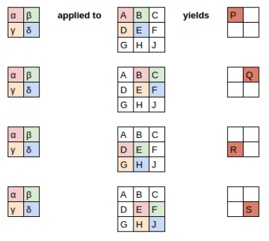
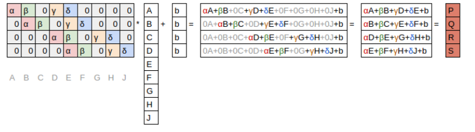
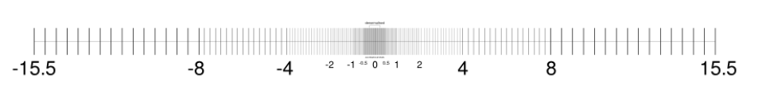

## Introduction

 Top-down teaching method 

Why study numerical linear algebra?

* important in computer science

4 things need consideration

* memory
* speed
* accuracy
* scalability

That means there will be trade-off while designing

<!-- more -->

## Matrix Computations

mainly 2 type of computation

* Matrix products

  * Matrix-Vector Products: e.g. **Markov Chain**, from one state to another state, there will be a probability matrix

  * Matrix-Matrix Products: e.g.  calculate different **situation**

    * images can be **represented** by matrices

    * **convolution**

      

      in matrix multiplication viewpoint

      

* Matrix decompositions

  * Topic modeling: SVD, QR
  * Background removal: robust PCA, SVD
  * PageRank algorithm

## Accuracy — How Computer Store **Numbers**

Why accuracy is a problem?

* Since computer store numbers **finite** and **discrete**
* Big problem while repeating an operation since each operation could **multiply** the error

Floats and doubles are **not equidistant**

Machine Epsilon: Half the distance between 1 and the next larger number 

* defined by IEEE standards 
*  $\varepsilon_{\text {machine}}=2^{-53} \approx 1.11 \times 10^{-16}$

### Conditioning and Stability

**We need to know how small change in input will influence the output**

> **"A stable algorithm gives nearly the right answer to nearly the right question."** --Trefethen
>
> since we can not tell the computer the “right” number

**Conditioning**: perturbation behavior of a mathematical problem (e.g. least squares)

**Stability**: perturbation behavior of an algorithm used to solve that problem on a computer (e.g. least squares algorithms, householder, back substitution, gaussian elimination)

* e.g. while calculating eigen value, a **small** change in the input will get totally wrong answer

### Approximation accuracy

Most of the time, we just **don’t need** to do highly matrix computations at scale, 

* machine learning, more **efficient**
* Bloom filter algorithm, **AdBlock**, would give false positives, **reduction** in **memory** use of thousands of times

## Memory Use – How Computer Store **Matrices**

A key way to save memory: just store the **non-zero elements**, this is called **sparse** storage. This is suited to sparse matrices that most elements are zero

The opposite, is **dense** storage, store every elements

## Speed – How Computer Compute Matrices

Some key points to be considerd

* Computational complexity: the big O notation, **algorithm**
* Vectorization: Modern GPU and CPU, use low-level APIs: BLAS, LAPACK, **hardware**
* Scaling to multiple cores and nodes
* Locality: move data around, **hardware**

## Scalability

Use multiple core and machine