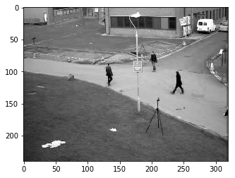
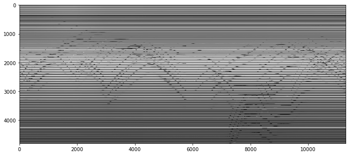
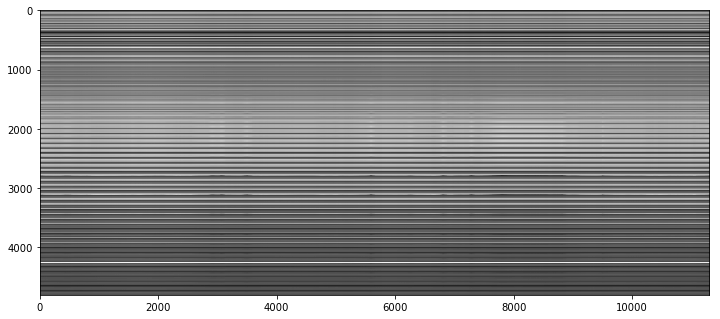
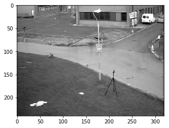

## Why PCA?

We often deal with high-dimentional data sets. Using PCA is handy for eliminating dimenstions

## Application: Background Removal



There is a video, we want to remove the background

### Load the Data

We can scale the image to $60\times 80$, and stack the image to a tall column $1\times 4800$

If the video contains $11300$ images, then the video can be represented as a $11300\times 4800$ matrix



## First Attempt: SVD

Preserver only 2 feature

```python
from sklearn import decomposition
u, s, v = decomposition.randomized_svd(M, 2)
u.shape, s.shape, v.shape
#((4800, 2), (2,), (2, 11300))
low_rank = u @ np.diag(s) @ v
low_rank.shape
#(4800, 11300)
plt.imshow(low_rank, cmap='gray')
plt.imshow(np.reshape(low_rank[:,140], dims), cmap='gray');#get one image from the video
```





Great, we got a good result

## PCA

* Classical PCA (SVD) : seeks the best rank-$k$ estiamte $L$ (Low Rank) of $M$, this is what we do **above**

  * Minimizing $||M-L||$
  * Can **only** handle small noise

* Robust PCA, factors a matrix into the sum of 2 matrices, $M=L+S$, **L**ow rank + **S**parse

  * Low rank: there is a lot of **redundant** information, in this case, is the background
  * Sparse: without the background, only people in the image, that means most of the elements in $S$ would be **zero**

### Robust PCA

Goal:
$$
minimize ||L\|_{*}+\lambda\|S\|_{1} \\
subject\ to \ L+S=M
$$

* $||\space||_1$ is the **L1 norm**, for a matrix, L1 norm equals to the maximum absolute column norm
  * **Why** L1 norm? we need $S$ to be sparse, and L1 norm would lead to **better sparsity**
    * Why L1 lead to better sparsity? See another blog..
* $||\space||_*$ is the **nuclear norm**, is the L1 norm of the singular values, minimize the result will lead to low rank