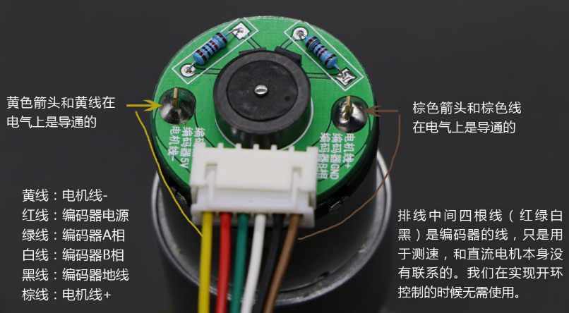
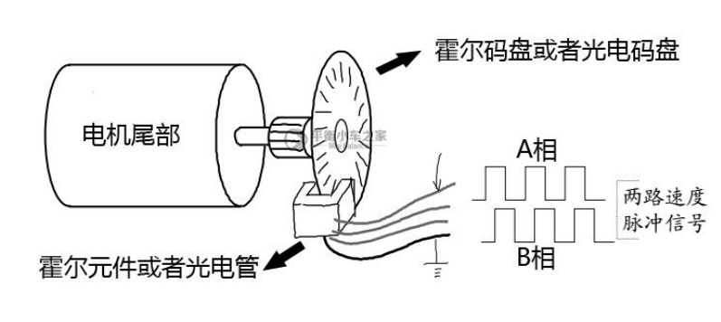

## 直流电机的结构与原理

(编码器)+定子+转子+电刷+(减速器)

在电刷上施加直流电压U，施加洛伦兹力，不断重复

一般直流电机的转速都是一分钟几千上万转的，所以一般需要安装减速器。

减速器是一种相对精密的机械零件，使用它的目的是降低转速，增加转矩

<!-- more -->

* 只有左右两根电机线决定了电机转速
  * 因此控制施加在两边的电压大小和极性就可以实现调试和换向
* 中间四根线都是编码器测速用的

## 编码器的使用

编码器是将角位移或者角速度转换成一连串电数字脉冲的**旋转式传感器**

根据输出类型分类

* 增量式
* 绝对式

根据检测原理分类

* 光学（光电编码器）、磁式（霍尔编码器）、感应式、电容式

### 编码器的原理（光电、霍尔）

目的：获取AB相输出的方波信号

### 编码器倍频技术

目的：真正把编码器的精度提高4倍

常规办法：只测量信号A**或者**信号B的上升沿**或者**下降沿

四倍频方法：测量信号A**和**信号B的上升沿**和**下降沿

### 编码器信号的采集

编码器的输出是标准的方波，通过单片机直接读取

软件中的处理方法

* STM32，硬件计数
* 51，通过外部中断读取

## 直流电机的控制

使用PID控制器，因为我们是软件实现，所以是离散式的PID控制器，在采样时间很短的情况下，可以考虑

* 一阶差分代替一阶微分
* 累加代替积分

### 位置的闭环控制

### 速度的闭环控制

