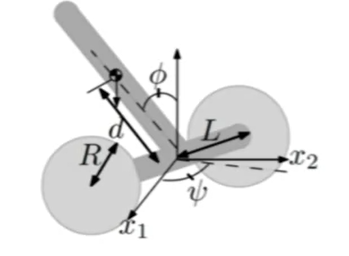

We need $x$ but we do have is only $y$. What can we do?

* Design $u$ as if we had $x$
* Figure out $x$ from $y$

## Assume We Got $x$

We can design the $k_1$ and $k_2$ to make the **eigenvalue** of the closed-loop system to be **desired** (**negative**) 

> e.g. If we want to the eigen value of the $-1$, then, $\varphi(\lambda)=(\lambda+1)(\lambda+1)=\lambda^{2}+2 \lambda+1$
>
> and we got $\chi_{A-B K}=\lambda^{2}+k_{2} \lambda+k_{1}$
>
> so just let $k_2=2$ and $k_1=1$, the system would be stable

To say it in another way, we place the **pole** of the system on the desired position

Still, we have some question about the method?

* This method is not always **possible**
  * The system needs to be controllable
* It’s a science and art of **picking** the eigenvalue
  * No clear-cut answer

<!-- more -->

## Controllability

The key matter here is the $B$ matrix, how *rich* is $B$ that we can control the system.

If we write the system this way
$$
\begin{aligned}
\begin{array}{l}
x_{1}=A x_{0}+B u_{0}=B u_{0}\\

x_{2}=A x_{1}+B u_{1}=A B u_{0}+B u_{1} \\
x_{3}=A x_{2}+B u_{2}=A^{2} B u_{0}+A B u_{1}+B u_{2}
\end{array}
\end{aligned}
$$
Then we can transform the system into 
$$
x=\Gamma u=[B \ AB \ ...\ A^{n-1}B]u
$$
if $Rank(\Gamma)=n$, it’s possible to **fully control** the system

if the system can be **fully controlled**, then we can put **arbitrary pole**
$$
Rank(\Gamma)\to Fully \ Control \to Arbitrary\ Pole
$$

> Application: Segway Robots
>
> Segway robots is simply unicycle+Inverted Pendulum+…
>
> 
>
> Model the system
> $$
> \begin{array}{l}
> x=\left[\begin{array}{lllllll}
> x_{1} & x_{2} & v & \psi & \dot{\psi} & \phi & \dot{\phi}
> \end{array}\right]^{T} \\
> u=\left[\begin{array}{ll}
> \tau_{L} & \tau_{R}
> \end{array}\right]^{T}
> \end{array}
> $$
> After linearization, $Rank(\Gamma)=6<7$, so the system is not fully controllality
>
> That's because unicycle mess up while linearization around (0,0)
>
> So we can shave off the $x_1$ and $x_2$. Now the system is fully controlled 
>
> * In this way, we only control the **curvature** of the path

## Observability

Actually, we don’t the real value of $x$, so we need sensor or observer to estimate $x$

Luenberger observer: predictor + corrector
$$
\dot{ \hat{x}}=A\hat x+L(y-C \hat x)
$$
predictor + corrector

* Does it work?

* How to pick $L$

  We want to stabilize the estimation error, $e=x-\hat x$
  $$
  \dot e=(A-LC)e
  $$
  so the it should be $Re(eig(A-LC))<0$

The system is completely observable if it is possible to recover the initial state from the output
$$
\Omega=\left[\begin{array}{c}
C \\
C A \\
\vdots \\
C A^{n-1}
\end{array}\right]
$$

$$
rank(\Omega)=n
$$

## Put it Together!

Now we have good building blocks

* controllability, observability, state feedback, observers, pole-placement

How do we put everything together?

Answer: **Separation Principle**

1. First of all, we need to make sure that our linear system is CC and CO

2. Design state feedback controller as if we had $x$

   let $u=-Kx$, and design $\dot x=(A-BK)x$

3. Estimate $x$ using observer, make sure the error estimation is zero

   $\dot e=(A-LC)e$

4. Analyze their joint dynamics, notice that $e=x-\hat x$

   Then $\dot{x}=A x-B K \hat{x}=A x-B K(x-e)=(A-B K) x+B K e$

   now we want $x$ and $e$ both go to zero
   $$
   \left[\begin{array}{c}
   \dot{x} \\
   \dot{e}
   \end{array}\right]=\left[\begin{array}{cc}
   A-B K & B K \\
   0 & A-L C
   \end{array}\right]\left[\begin{array}{c}
   x \\
   e
   \end{array}\right]
   $$
   Since this is an upper triangular block-matrix. So the eigenvalues are given by the **diagonal blocks**

   **EVERYTHING WORKS** because they are **separated** 

## Practical Considerations

* Eigenvalue Selection

  1. Observer should be faster than the controller. 
  2. So we need to make sure the eigenvalue of observer smaller than the controller

* Reference Tracking

  1. We want to move the robots to $\theta_d$, so the $e$ became $\begin{array}{c} \theta-\theta{_d} \\\dot \theta \end{array}$
  2. transform the system into regular system, and apply regular methodology

* Beyond Pole Placement

  * The methodology we developed does not need to be based on pole placement

  * e.g. $K$ could be calculated by using LQ optimal control

    $L$ could be calculated by using the Kalman Filter

## Example

### Part 1: Design

We have a system $\dot x=Ax$, and $eig(A)=0$, so the system is unstable.

Hence we introduce control.

1. See what we can control, and write down the $B$ matrix to check is this system controllable by checking the $\Gamma$ Matrix

   * If the system is **uncontrollable**, then we should **introduce more motors**
2. Design state feedback control $u=-Kx$, we get $\dot x=(A-BK)x$

   * Pick favorite eigen value, calculate $K$
3. Choose what we can “see”, what we can sensor, measure. In this we get our $C$ matrix to check is this system observable by checking the $\Omega$ matrix
4. Design the estimator $\dot {\hat {x}}=A \hat{x}+B u+L(y-C \hat{x})$
   we get $\dot e=(A-LC)e $ and calculate $L$

### Part 2: Executing

Loop

1. Initialize $t=t_0 ,x=x_o,\hat x=\hat{x_0}$
2. Start Loop (dt increments)
   1. read the output
   2. Compute control signal $u=-K\hat x$
   3. send the control signal to the motors
   4. output and compute control signal $u=-K\hat x$
   5. update the $\hat x$ using $\dot {\hat {x}}=A \hat{x}+B u+L(y-C \hat{x})$ and $\hat{x}_{k+1}=\hat{x}_{k}+d t \hat{x}$